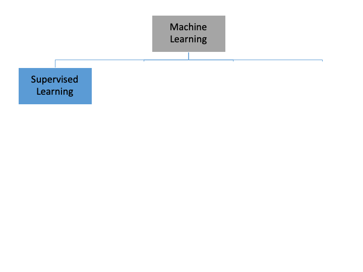
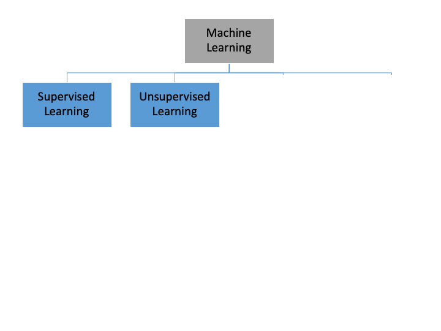
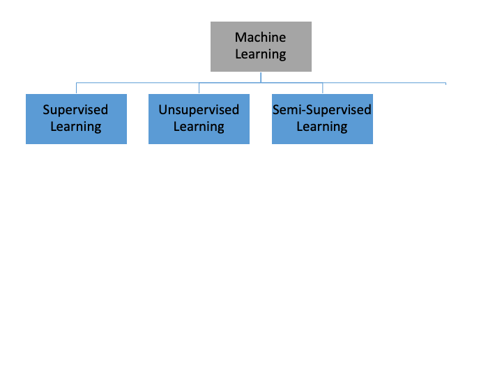
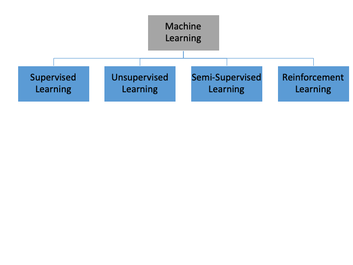
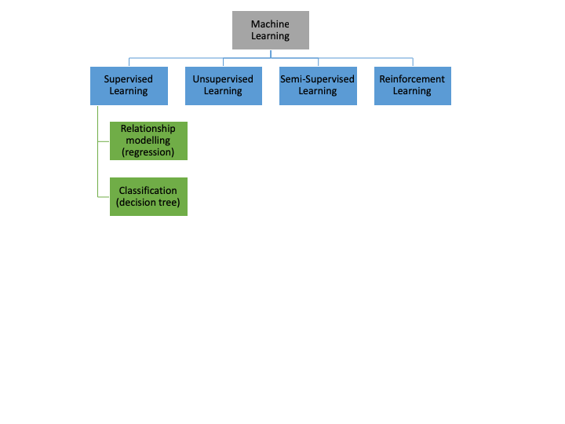
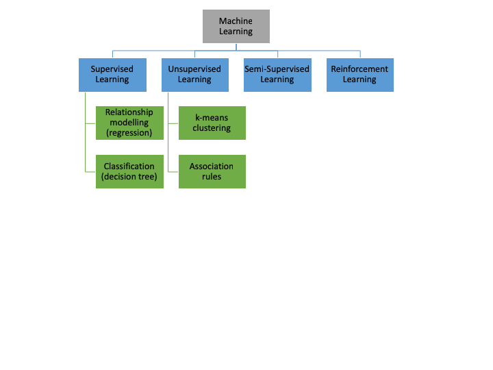
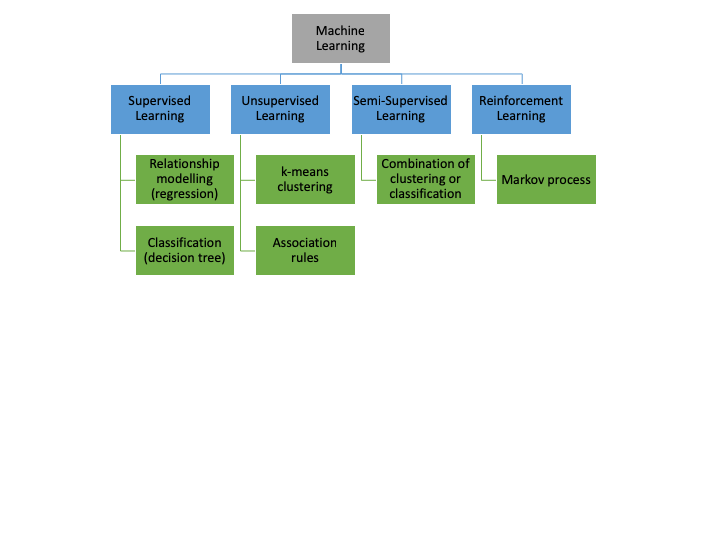
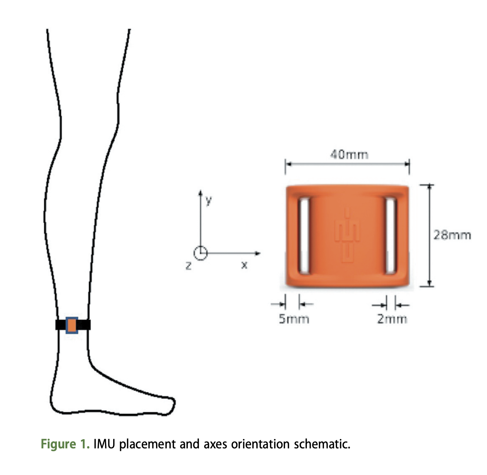
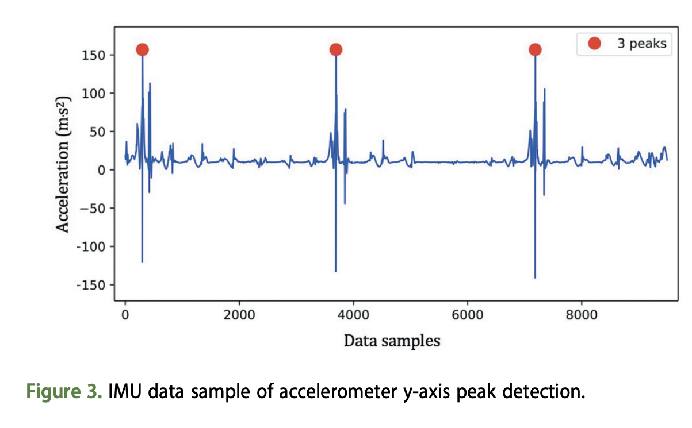

---
output:
  xaringan::moon_reader:
    css: [default, "VictoriaUniversity.css", "rladies-fonts"]
    nature:
      highlightStyle: github
      highlightLines: true
      countIncrementalSlides: false
      ratio: 16:9 

---


```{r setup, include=FALSE}
options(htmltools.dir.version = FALSE, knitr.table.format = "html")
knitr::opts_chunk$set(fig.retina = 3, warning = FALSE, message = FALSE)
library(tidyverse) 
library(icons)  
```

```{r xaringan-tachyons, echo=FALSE}
xaringanExtra::use_tachyons()
```


class: inverse, right
background-image: url(https://img.rawpixel.com/s3fs-private/rawpixel_images/website_content/upwk61736958-wikimedia-image.jpg?w=1300&dpr=1&fit=default&crop=default&q=80&vib=3&con=3&usm=15&bg=F4F4F3&auto=format&ixlib=js-2.2.1&s=229dce74adfbd1584aa717e4a2b7b4ad)
background-size: cover 

# Sport - Powered by Machine Learning

<br>
<br>
<br>
<br>
<br>
<br>
<br>
## Alice Sweeting, PhD
#### Lecturer (Sport Science & Analytics)
#### Graduate Certificate in Data Analytics for Sport Performance

.logoposRB[
  
]

---
class: inverse, right, bottom, hide_logo
background-image: url(https://s3.ap-southeast-2.amazonaws.com/hdp.au.prod.app.yrra-yoursay.files/5315/7404/0550/BPP9377.jpg)
background-size: cover


.caption[
Image: [City of Yarra](https://aboriginalhistoryofyarra.com.au/)
]

???

I’d like to begin by acknowledging the Traditional Owners of the land on which we meet today, which for me in Richmond, Victoria, are the Wurundjeri-willam people of the Kulin Nation. 
I'd also like to acknowledge all Traditional Owners of Country throughout Victoria and pay our respect to their culture, Elders past, present and future. 

---

class: left, bottom, inverse
background-image: url(https://cdn.pixabay.com/photo/2016/03/26/13/09/workspace-1280538_1280.jpg)
background-size: cover

# A (brief) Overview of... 


  * ## Data Hurdles in Sport Science
  
--
  <br>
  * ## What is Machine Learning?
  
--
  <br>
  * ## Techniques for Data Analysis
  
--
  <br>
  * ## Applications for Sport Performance

---
class: left

# Data Hurdles in Sport Science

`r icons::fontawesome("database", style = "solid")`  Importing data from wearables/ different platforms and exports .csv/ .pdf/ .txt etc

--

<br>
`r icons::fontawesome("not-equal", style = "solid")`  Synchronising data from different systems at differing sample rates

--

<br>
`r icons::fontawesome("exclamation-circle", style = "solid")`  Dealing with messy, manual, incomplete data sets!

--

<br>
`r icons::fontawesome("users-cog", style = "solid")`  Dealing with breadth and depth (strength & conditioning, medical, coaching, recruiting etc)


.bg-washed-green.b--dark-green.ba.bw2.br3.shadow-5.ph4.mt5[
The challenge we all face is how to maintain the benefits of breadth, diverse experience, interdisciplinary thinking, and delayed concentration in a world that increasingly incentivizes, even demands, hyperspecialization

.tr[
— David Epstein, Range: How Generalists Triumph in a Specialized World
]]

???
As sport scientists, we are often the ones setting up testing or monitoring equipment, collecting the data, then working with coaches, athletes and other performance staff to interpret the data to help make meaningful decisions.
We need to be specialists with equipment, ensure we are collecting valid and reliable data, we need to be empathetic and understanding humans when also working with athletes to collect and capture data. Then we need to turn into data analysts, to synthesise and visualise all this data in a useful manner. Then we need to work within our disciplines (etc physiologists/ biomech/ dietitians) to use this specific knowledge and again interpret the data. So we are generalists, diving in and out of this specialist world, using our broad sport science training but our specific discipline knowledge to help us answer questions about human performance

---

class: left, bottom, inverse
background-image: url(https://cdn.pixabay.com/photo/2016/10/26/12/48/excel-1771393_1280.jpg)
background-size: cover

???
- Many of you probably work in excel to complete these data activities and that is OK! But Excel can be limited...
- Time spent dragging/ dropping/ clicking/ repetitative tasks
- Files too big/ data saved everywhere, different versions, different databases etc

---
class: top, left, inverse
background-image: url(https://img.rawpixel.com/s3fs-private/rawpixel_images/website_content/upwk61768053-wikimedia-image.jpg?w=1300&dpr=1&fit=default&crop=default&q=80&vib=3&con=3&usm=15&bg=F4F4F3&auto=format&ixlib=js-2.2.1&s=521cd3aa95a41faf14b9c46403bd159f)
background-size: cover

# Moving out of the (spreadsheet program) dark...

???
- Another disadvantage of using a spreadsheet program is that we are limiting ourselves to the type of analysis we can perform
- Especially if we are looking to understand more about the non-linearity and complexity in performance sport data
- Unfortunately, most spreadsheet programs and click/ point statistical analysis programs are generally limited to parametric analysis. So if we wish to perform non-parametric analysis, or dig a little deeper into understanding more about patterns and complexity within our large sport performance dataset, we are ultimately going to have to move outside of these types of programs and be adaptable

---
class: top, left, inverse, hide_logo
background-image: url(https://images.unsplash.com/photo-1611315350692-f1ffc82012e0?ixlib=rb-1.2.1&ixid=MnwxMjA3fDB8MHxwaG90by1wYWdlfHx8fGVufDB8fHx8&auto=format&fit=crop&w=3840&q=80)
background-size: cover 

# Adaptability

# .BottomRight[Versatility]

???
- Talk about these traits with athletes whom we work with, but what about ourselves when it comes to analysing data?
* Application of different types of analytical approaches to the same data set is a way in which high performance staff can display versatility
* Developing a working knowledge of various analysis methodologies is a useful trait, irrespective of whether you choose to delve into these in a hands on manner on not. For example, having an understanding of how the different types of machine learning techniques can handle the same problem, is really useful to know. Even if right now, you don't have the skills or feel confident in running through these tehcniques


---
class: left, bottom, inverse
background-image: url(https://cdn.pixabay.com/photo/2020/02/15/14/19/network-4851079_1280.jpg)
background-size: cover

# Machine Learning

???
- Now going to talk about machine learning approaches - which allow us to dive deep into the complexity and uncertainity of some of those bigger questions in sport performance. 
- For example, how can we train a model to recognise the gait pattern of an athlete? How we can exmaine more than one skilled constraint and the interactions of different constraints, during team-sport performance?

---
class: center, top
# What is Machine Learning?

.bg-washed-blue.b--dark-blue.ba.bw2.br3.shadow-5.ph4.mt5[
  Machine learning is a branch of artificial intelligence (AI) and computer science which focuses on the use of data and algorithms to imitate the way that humans learn, gradually improving its accuracy.
  
.tr[
 — IBM
  ]]

--
  
.bg-washed-blue.b--dark-blue.ba.bw2.br3.shadow-5.ph4.mt5[
    Machine learning is a subfield of artificial intelligence, which is broadly defined as the capability of a machine to imitate intelligent human behavior. Artificial intelligence systems are used to perform complex tasks in a way that is similar to how humans solve problems.
    
.tr[
 — MIT Sloan
  ]]

???
  - Machine Learning is defined as the study of computer programs that leverage algorithms and statistical models to learn through inference and patterns without being explicitly programmed. Machine learning approaches have been popularised recently, due to their ability to learn from data, without being explicitly instructed or programmed to do so 

---
class: center, top
# Machine Learning Tasks

  
???
- Going to now get into some technical language and definitions, to help you learn precisely what machine learning is, then how it can be applied in sport
  - Within machine learning, there are multiple ‘families’ of algorithms exist that can each be applied to the same data set to form differing outputs, decisions and recommendations. Although often represented in different ways, these are often considered based on the tasks they perform including; Supervised, Unsupervised, Semi-Supervised and Reinforcement learning. 
- Supervised machine learning algorithms can apply what has been learned in the past to new data using labeled examples to predict future events. Starting from the analysis of a known training dataset, the learning algorithm produces an inferred function to make predictions about the output values. The system is able to provide targets for any new input after sufficient training. The learning algorithm can also compare its output with the correct, intended output and find errors in order to modify the model accordingly.
- Supervised tasks relate to those that rely on labelled data; specifically data which consists of paired inputs and outputs. For example, for each action or set of actions (i.e., kinematic data whilst undertaking a 20 m sprint), a resultant output or event (i.e., 20 m sprint time) is also included. 
- Labelled datasets can then be used for the purposes of training an algorithm, thereby leading to the modelling of relationships and inter-dependencies between an output variable (be it continuous or categorical) and its corresponding set of inputs. Consequently, supervised tasks are commonly used for prediction problems.

---
class: center, top
# Machine Learning Tasks

  
???
  - In contrasts, unsupervised machine learning algorithms are used when the information used to train is neither classified nor labeled. Unsupervised learning studies how systems can infer a function to describe a hidden structure from unlabeled data. The system doesn’t figure out the right output, but it explores the data and can draw inferences from datasets to describe hidden structures from unlabeled data.
- In contrast, unsupervised tasks consist of unlabelled data, whereby an output variable is either unknown or not required. Consequently, they tend to be more useful for descriptive purposes, or uncovering new patterns in previously unexplored datasets. 


---
class: center, top
# Machine Learning Tasks

  
???
  - Semi-supervised machine learning algorithms fall somewhere in between supervised and unsupervised learning, since they use both labeled and unlabeled data for training – typically a small amount of labeled data and a large amount of unlabeled data. The systems that use this method are able to considerably improve learning accuracy. Usually, semi-supervised learning is chosen when the acquired labeled data requires skilled and relevant resources in order to train it / learn from it. Otherwise, acquiring unlabeled data generally doesn’t require additional resources.
- So these tasks they consist of some combination of labelled and unlabelled data. 

---
class: center, top
# Machine Learning Tasks

  
  
???
  - Reinforcement machine learning algorithms is a learning method that interacts with its environment by producing actions and discovers errors or rewards. Trial and error search and delayed reward are the most relevant characteristics of reinforcement learning. This method allows machines and software agents to automatically determine the ideal behavior within a specific context in order to maximize its performance. Simple reward feedback is required for the agent to learn which action is best; this is known as the reinforcement signal.
- Reinforcement tasks entail a machine being exposed to a given environment in order for it to train itself through an iterative process of trial and error 

---
class: center, top
# Machine Learning Techniques

  
  
???
  - Under each of these tasks, various techniques exist by which these tasks can be carried out. These techniques are often grouped into five types. 
- For supervised tasks, i) relationship modelling and ii) classification methods are typically used. 
- Relationship modelling is perhaps the most commonly observed. It works by fitting a function or model that best describes relationships between a set of variables and a specific outcome of interest (dependent variables). Regression analysis is the best-known type of relationship modelling, with multiple variations available. 
- The other form of supervised learning, classification, aims to predict a given discrete class output (i.e., category or group) using a set of input variables 
- Here, decision trees can be used, for example to explain ‘win/loss’ match outcome in team sports 

---
class: center, top
# Machine Learning Techniques

  
  
???
  - Clustering represents a method of unsupervised learning that aims to summarise key features of data into groups using just the features of the data and no output information (unlike in classification)
- The result of a cluster analysis is the formation of a number of groups, which in some cases are defined by the end-user. Instances or items are grouped together based on their level of similarity as defined by these features, or the extent to which they are dissimilar to other groups
- k-means; used to develop distinctive team profiles based on performance indicators 
- Association rule mining, aims to extract meaningful and typically frequently occurring patterns in data (Agrawal, Imielinski & Swami, 1993). A number of types of rule mining exist. Simple association rule mining aims to discover commonly occurring associations with different states, whereas sequential rule mining also emphasises the time course or sequencing of such events. Examples of these in sport may be used to identify constraint patterns in training environments (Robertson et al., 2019) and preferred patterns of play in team sport 

---
class: center, top
# Machine Learning Techniques

  
  
???
 - Semi-supervised and reinforcement tasks may employ combinations of these other approaches, although in reinforcement learning, markov processes can be used. 
- Example is a model which describes a sequence of possible events in which the probability of each event depends only on the state attained in the previous event. 
- In sport, an example of this could be player evaluation or handicapping

---
class: bottom, inverse, hide_logo
background-image: url(https://cdn.pixabay.com/photo/2014/10/14/20/24/football-488714_1280.jpg)
background-size: cover 

# Applications of Machine Learning in Sport

---
class: left, top 
# Applications of Machine Learning in Sport

#### .center[Training A Model To Classify Kicks in Australian Football]

Work by [Emily Cust, PhD](https://twitter.com/EmCust) who used inertial measurement units (IMUs) to classify Australian Rules football (AF) kick types in an applied environment using ankle-mounted IMUs.


.pull-left[
  
] 

.pull-right[
  
] 

.right[
.tiny[
Images: [Classification of Australian football kick types in-situation via ankle-mounted inertial measurement units (JSS)](https://www.tandfonline.com/doi/abs/10.1080/02640414.2020.1868678)]]

???
IMUs and video capture of a controlled protocol, including four kick types at varying distances, were recorded during a single testing session with 20 female AF athletes. Processed IMU data were modelled using support vector machine classifier, random forest, and k-nearest neighbour algorithms under a 2-Kick, 4-Kick, and kick distance (10, 20, 30 m) conditions. The random forest model showed the highest results for overall classification accuracy, highlighting the potential for an applied semi-automated AF training kick detection and type classification system using IMUs. 
- Anyone who has had to film and manually notate how many kicks, or skilled actions, an athlete performs during a training session will know just laborious this task is! Hence the ability to use wearable sensors and machine learning approaches to help classify kick counts is super useful, turning around analysis quicker and freeing up the time of the performance analyst to focus on interpreting the data for evaluating the training session.


---
class: left, top 
# Applications of Machine Learning in Sport

#### .center[Understanding the Interaction of Constraints in Australian Football]

Work by [Peter Browne, PhD](https://twitter.com/_PeterBrowne) who explored the interaction of skilled constraints using rule-mining techniques

.center[

]
.tiny[
[Browne et al., (2019). Prevalence of interactions and influence of performance constraints on kick outcomes across Australian Football tiers: Implications for representative practice designs. *Human Movement Science*](https://www.sciencedirect.com/science/article/pii/S0167945719301939) 
]

???
* I spoke on the previous slide about classifying kicks in Australian Football and counting these. Currently, events and outcomes are captured in statistical analysis of team sports performance. This is frequency count data where a human manually codes performance variables including kicks, tackles and handballs, live during a game or post-hoc via video 
* Kicking is an important action in AF, as it constitutes the predominant form of strategic ball movement and the sole manner in which a goal can be scored.
* On average, each player executes a kick every ten minutes within an AFL match 
* The completion of a successful kick is a resultant of multiple attributes of the game and the immediate constraints that emerge on the kick, such as opposition pressure, team mates’ availability and the current status of the ball carrier
- Determining the influential constraints within competitive performance, with respect to their impact on key performance outcomes, would provide an evidence-based approach to practice designs, harnessing the power of performance analysis and evaluations
* For example, we can look at the source of the kick, so in an AFL context was it from a mark/ free kick or at a stoppage. Was the player on the run whilst kicking or stationary? Did they get rid of the ball in less than two seconds or was it six seconds? How long was the kick? Was the player being tackled whilst they were trying to kick the ball?
* These constraints can also interact with one another, in non-linear manner
* Here is work from Peter Browne's PhD thesis, where he measured the context or constraints surrounding skilled involvements during Aussie Rules football.
* So if we take a kick, as an example, we can assess the influence that these different constraints have together, on the likelihood of an effective kick. We can do this through rule mining techniques, which is very common in a marketing space but also now widely used in sports analytics.
*  Example of how adding additional constraint variables and considering the constraint interaction alters the mean efficiency of the kick outcome. 
* Percentage values indicate confidence level of an effective kick. We can see as constraints accumulate, the average kicking efficiency is altered
]

---
class: left, top 
# Applications of Machine Learning in Sport

#### .center[Using Time-Series Analysis to Profile Physical Output Data]

Work by [David Corbett, PhD](https://twitter.com/DMCorbett) examining how time-series analysis can be used to understand continuous trace data

.center[

]

???
- We can describe physical and skilled output in an aggregate sense, via modelling and conditonal inference trees
- However the degree to which these output change throughout a team-sport match, as a function of time, is relatively unknown. There are likely periods of altered physical and skilled output that are not captured by aggregate parameters
- By inference it is therefore problematic to use measures of physical and skilled output to inform decisions whereby time is expected to exert an influence
- Here is we have raw trace data, from a wearbale sensor. This is from a team-sport athlete, but it could be from an indiviual athlete too, etc say the power output of a cyclist during a road or track race.
* Here we have time on our x-axis and velocity on our y-axis, giving us a visual into an athlete's "active" time spent on the ground

---
class: left, top 
# Applications of Machine Learning in Sport

#### .center[Using Time-Series Analysis to Profile Physical Output Data]

Work by [David Corbett, PhD](https://twitter.com/DMCorbett) examining how time-series analysis can be used to understand continuous trace data

.center[

]

???
* Logical extension to seperate activity into low and high-intensity, like we do with our aggregate data
* Thresholds used are often arbitary and can be individualised, although it is tricky
* Although it is difficult to determine how output changes throughout a team-sport match, as a function of time

---
class: left, top 
# Applications of Machine Learning in Sport

#### .center[Using Time-Series Analysis to Profile Physical Output Data]

Work by [David Corbett, PhD](https://twitter.com/DMCorbett) examining how time-series analysis can be used to understand continuous trace data

.center[

]

???
* We can do this via time-series analysis, so here the (hypothetical) vertical red bars represent different segements found in our continuous trace
* Identify and describe segments of physical output in team-sport matches that are very different.
* This differs to moving averages, where we need to first self-select the rolling average window of length etc (1 or 5 mins) and the data is then averaged over that period.  

---
class: left, top 
# Applications of Machine Learning in Sport

#### .center[Using Time-Series Analysis to Profile Physical and Skilled Output Data]

Work by [David Corbett, PhD](https://twitter.com/DMCorbett) examining how time-series analysis can be used to understand continuous trace data
.center[

]
.tiny[
[Corbett et al., (2019) A change point approach to analysing the match activity profiles of team-sport athletes. *Journal of Sports Sciences*](https://pubmed.ncbi.nlm.nih.gov/30747582/)
]


???
- Here is the same data type, raw LPS or GPS data and skilled output, analysed as a time series
- Blue and red circles indicate offensive and defensive skilled involvements, respectively. Offensive involvements are our kicks and handballs, defensive involvements are tackles and pressure acts, so bumps. This study was also conducted with Australian Rules football athletes too
Fixed vertical lines denote change point location, for a single player across a single match. Players names are de-identified so we have a), b), c) and d) etc
- The physical output of team-sport athletes was split into between two and 16 segments and then summarised each of these segments using spectral features and a measure of skilled output
- Each of these segments was categorised by data points with a different mean or variance, compared to the previous or subsequent segment
- These segments varied in their location and duration between players and had only a small relationship with on-field stint end time. This highlights the importance of analysing velocity data as a time series, as aggregating across quarters or on-field stints may not be sufficient when analysing changes in physical output. Aggregate across three or five minute periods and this granulairty may be lost.
- Skilled output, measured through match involvements, showed no clear differences between segments. Consequently, they were the weakest features in the random forest model for classification. This highlights the dynamic nature of skilled actions in AF. Skilled output can be affected by many factors including the strategy of the opposing team, player roles, team composition and team form
- The methods utilised in this study could also be applied in sports where pacing is a key strategy. In track cycling, for example, the ability of athletes to increase or decrease their velocity at crucial moments in an event is a key strategic consideration

---
class: bottom, inverse, hide_logo
background-image: url(https://images.unsplash.com/photo-1564890350004-c051c6757cf0?ixlib=rb-1.2.1&ixid=MnwxMjA3fDB8MHxwaG90by1wYWdlfHx8fGVufDB8fHx8&auto=format&fit=crop&w=2850&q=80)
background-size: cover 

# Machine Learning - Benefits & Pitfalls
<br>
<br>
<br>


---
class: center, top
# Machine Learning - Benefits

.pull-left[
* Varying analytical approaches can be used to address the same problem
]

--

.pull-left[
* Consideration of complexity and non-linearity within data/ problem
]

--

.pull-left[
* Awareness of different techniques permits greater flexiblity 
]

--

.pull-left[
* Can be deployed through programming languages (R, Python etc) 
]


---
class: center, top
# Machine Learning - Pitfalls


.pull-left[
* Garbage in, definitely equals garbage out!
]


???
- no amount of sophisticated modelling will cause a recommendation to be of value to the end user or human if it is based on flawed data
- Error is inherent in all measurement, we could spend an entire afternoon on the measurement properties of tools!
- Understand the validity and reliability or accuracy and precision of the tools that you use! 


--

.pull-left[
* Models can be prone to overfitting (and underfitting)
]

<br>


.small[Image from IBM]


???
- Overfitting can be defined as an analysis that corresponds too closely or exactly to a particular set of data, and may therefore fail to fit additional data or predict future observations reliably. Essentially, an over-fitted model is one that contains more inputs than can be justified for the given problem. Unfortunately, many of the machine learning techniques introduced before can be susceptible to overfitting. This is because they tend to be more flexible in their ability to map complex data than many linear techniques and can therefore often derive more specific solutions to a given problem.
- The most common way of testing overfitting is through cross-validation
- An example of overfitting with respect to sport science can be given in talent identification, whereby a model to predict future performance of an athlete is constructed based on historical data collected from previous successful performers. The model is then used to predict the career trajectories of newly tested athletes to help inform whether they should be admitted into a funded program. In this scenario, an underfit solution may utilise a single value or linear function to classify these ‘successful’ or ‘unsuccessful’ athletes. For instance, it might stipulate that in order for an athlete to succeed at a given sport, they are required to be of a minimum height or body mass. 

---
class: center, top

## **Benefits of Learning Programming for Machine Learning** 

.left[
* Quickly create beautiful, interactive and reproducible [graphics](https://ggplot2.tidyverse.org/) 
]
--
.left[
* Create [presentations](https://github.com/yihui/xaringan) from code (such as this one!)
]
--
.left[
* [Packages](https://cran.r-project.org/web/packages/available_packages_by_name.html) that allow for data cleaning, manipulation, visualisation and reporting.
]
.right[
.tiny[
Artwork by [@allison_horst](https://github.com/allisonhorst/stats-illustrations)
]
]

---
class: center, top

## **Benefits of Learning Programming for Machine Learning** 


.right[
.tiny[
Artwork by [@allison_horst](https://github.com/allisonhorst/stats-illustrations)
]
]

???
- Automate time-consuming workflows and generate specific reports


---
class: center, top
# How to get started with R and Machine Learning?

.left[
* First, install [R](https://www.r-project.org/) (required) from your local CRAN.
]

--
.left[
* Next, install [RStudio](https://www.rstudio.com/products/rstudio/), as it is a friendly interface to learn and use R.
]

--
.left[
* Plenty of free, online resources to help learn, including [RStudio Education](https://education.rstudio.com/).
]
--
.left[
* Read [R for Data Science](https://r4ds.had.co.nz/) by Garrett Grolemund and Hadley Wickham
]
--
<br>
Start out with a small dataset that you know really well
--
<br>
Try to reproduce someone else's analysis. See `#TidyTuesday`
--
<br>
Share (and write about!) your code in publications!


---
class: center, top
# Interested in Learning More?

.pull-left[See our new [Graduate Certificate in Data Analytics for Sport Performance](https://www.vu.edu.au/courses/graduate-certificate-in-data-analytics-for-sport-performance-stsp) at Victoria University!

A six month short-course, encompassing four units on programming, sports analytics, machine learning approaches for spatiotemporal data and decision making

Study online, in a self-paced manner (no formal classes to attend), anywhere in Australia or the world

Heavily subsidised fees for domestic Australian students in 2022]

--

.pull-right[ 

.bottom[
```{r icon-chunk, echo=FALSE}
fontawesome("envelope", style = "solid")
```
Alice.Sweeting@vu.edu.au
]
]

