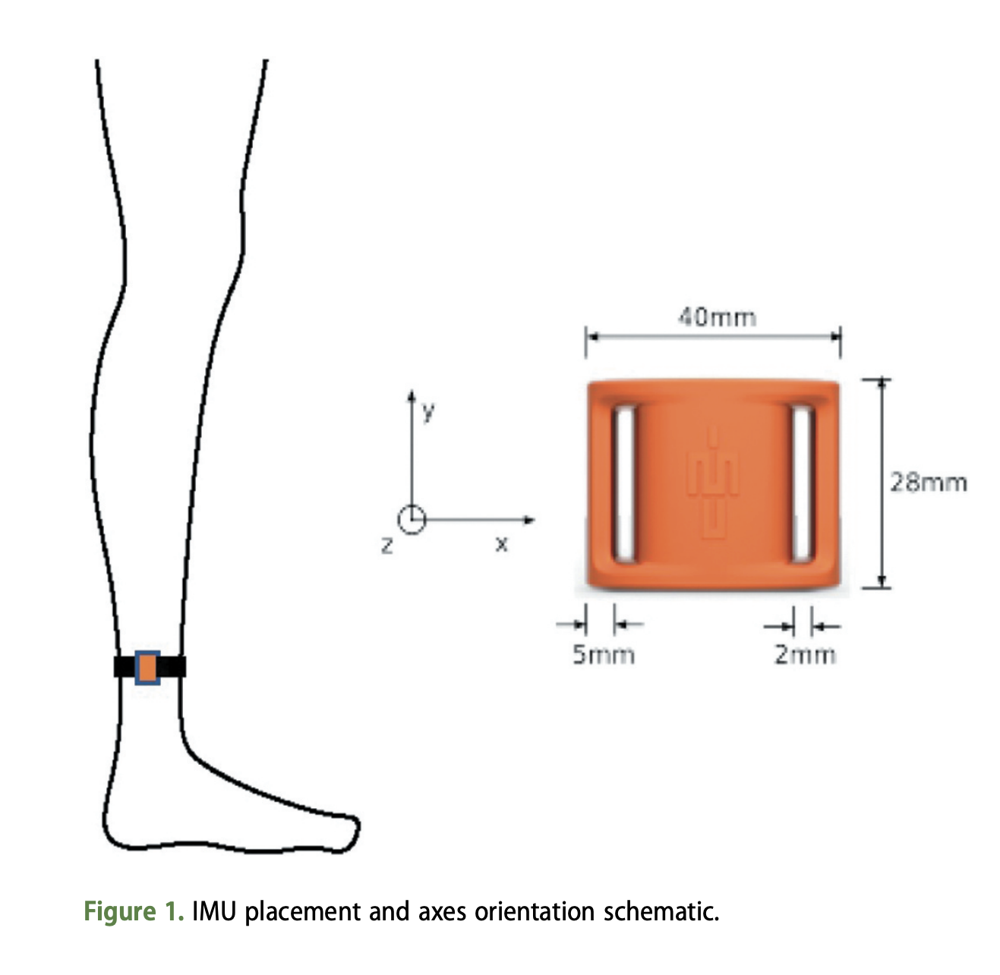
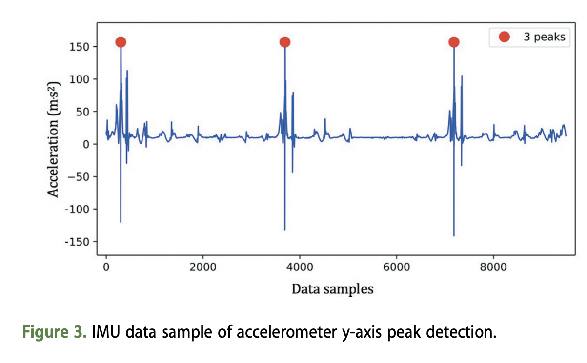

---
output:
  xaringan::moon_reader:
    css: [default, "VictoriaUniversity.css", "rladies-fonts"]
    nature:
      highlightStyle: github
      highlightLines: true
      countIncrementalSlides: false
      ratio: 16:9 

---


```{r setup, include=FALSE}
options(htmltools.dir.version = FALSE, knitr.table.format = "html")
knitr::opts_chunk$set(fig.retina = 3, warning = FALSE, message = FALSE)
library(tidyverse) 
library(icons)  
```

```{r xaringan-tachyons, echo=FALSE}
xaringanExtra::use_tachyons()
```


class: inverse, right
background-image: url(https://img.rawpixel.com/s3fs-private/rawpixel_images/website_content/upwk61736958-wikimedia-image.jpg?w=1300&dpr=1&fit=default&crop=default&q=80&vib=3&con=3&usm=15&bg=F4F4F3&auto=format&ixlib=js-2.2.1&s=229dce74adfbd1584aa717e4a2b7b4ad)
background-size: cover 

# Sport, Data & Analytics 

<br>
<br>
<br>
<br>
<br>
<br>
<br>
## Alice Sweeting, PhD
#### Lecturer | Research Fellow (Sport Science & Analytics)

.logoposRB[
   
]

---
class: inverse, right, bottom, hide_logo
background-image: url(https://s3.ap-southeast-2.amazonaws.com/hdp.au.prod.app.yrra-yoursay.files/5315/7404/0550/BPP9377.jpg)
background-size: cover


.caption[
Image: [City of Yarra](https://aboriginalhistoryofyarra.com.au/)
]

???

I wish to acknowledge the people of the Kulin Nations, on whose land we are gathered today. I pay my respects to their Elders, past and present.

Pictured is the river Birrarung, near where I live, whose Traditional Owners where I live and usually work, are the Wurundjeri-willam people of the Kulin Nation. 

---

class: left, bottom, inverse
background-image: url(https://cdn.pixabay.com/photo/2016/03/26/13/09/workspace-1280538_1280.jpg)
background-size: cover

# A (brief) Overview of... 
<br>

  * ## My Research Journey
  
--
  <br>
  * ## Current Sports Analytics Work
  
--
  <br>
  * ## Creating a Sports Analytics course from scratch  

---
class: left, top 
# A little about me...

.pull-left[

]

.pull-right[
* LOVED (read; lived, talked and breathed) horses.
]

---
class: left, top 
# A little about me...

.pull-left[

]

.pull-right[
* LOVED (read; lived, talked and breathed) horses.

**2008 to 2011** | Bachelor of Sport and Exercise Science/ Bachelor of Sport and Recreation Management
.right[Victoria University]


**2012** | Bachelor of Applied Sciences in Human Movement (Honours)
.right[Victoria University]


**2013 to 2016** | Doctor of Philosophy (PhD - [Research Thesis)](http://vuir.vu.edu.au/34111/)
.right[Victoria University, AIS and Netball Australia]

]

---
class: left, top 
# A little about me...

.pull-left[

]

.pull-right[
* LOVED (read; lived, talked and breathed) horses.

**2008 to 2011** | Bachelor of Sport and Exercise Science/ Bachelor of Sport and Recreation Management
.right[Victoria University]


**2012** | Bachelor of Applied Sciences in Human Movement (Honours)
.right[Victoria University]


**2013 to 2016** | Doctor of Philosophy (PhD - [Research Thesis)](http://vuir.vu.edu.au/34111/)
.right[Victoria University, AIS and Netball Australia]

<br>
* Investigated the movement sequences of netball athletes, using data mining techniques 

]

---
class: left
.center[
# Sport Scientist (WB) & Researcher (VU)
]

.pull-left[
 
]

.pull-right[
Responsible for:

* Ensuring knowledge exchange between VU-WB

]

---
class: left
.center[
# Sport Scientist (WB) & Researcher (VU)
]

.pull-left[
 
]

.pull-right[
Responsible for:

* Ensuring knowledge exchange between VU-WB

* Capturing data and monitoring athletes

]

---
class: left
.center[
# Sport Scientist (WB) & Researcher (VU)
]

.pull-left[
 
]

.pull-right[
Responsible for:

* Ensuring knowledge exchange between VU-WB

* Capturing data and monitoring athletes

* Driving the sport science research program 

]

---
class: left
.center[
# Sport Scientist (WB) & Researcher (VU)
]

.pull-left[
 
]

.pull-right[
Responsible for:

* Ensuring knowledge exchange between VU-WB

* Capturing data and monitoring athletes

* Driving the sport science research program 

* Supervision of student (Honours and PhD) research

]

---
class: left
.center[
# Sport Scientist (WB) & Researcher (VU)
]

.pull-left[
 
]

.pull-right[
Responsible for:

* Ensuring knowledge exchange between VU-WB

* Capturing data and monitoring athletes

* Driving the sport science research program 

* Supervision of student (Honours and PhD) research
<br>
<br>
.center[
.large[
**Working with a variety of different people (coaches, physiotherapists, analysts, students and athletes etc) on a large number of short- and long-term projects**
]
]
]

---
class: left, top
# Examples of Sports Analytics & Research Work

.NonVU[
### `r icons::fontawesome("question-circle", style = "solid")` Monitor how hard an athlete works during a training session.
]

--

.NonVU[
### `r icons::fontawesome("running", style = "solid")` Collect an athlete's physical output during training and matches.
]

--

.NonVU[
### `r icons::fontawesome("football-ball", style = "solid")` Record the number of skilled involvements during drills and matches.
]

--

.NonVU[
### `r icons::fontawesome("users", style = "solid")` Quantify the interactions between team-members during training and matches.
]

--

.NonVU[
### `r icons::fontawesome("chart-line", style = "solid")` Track the performance of potential recruits and draft selections.
]

--

.NonVU[
### `r icons::fontawesome("utensils", style = "solid")` Estimate the energy expenditure of athletes during training and matches.
]


---
class: bottom, inverse, hide_logo
background-image: url(https://cdn.pixabay.com/photo/2014/10/14/20/24/football-488714_1280.jpg)
background-size: cover 

# Current Sport Analytics Work


---
class: inverse, bottom
background-image: url(https://images.catapultsports.com/wp-content/uploads/2018/05/Fundamentals.jpg)
background-size: cover

.left[
.caption[
Image source: [Catapult Sports](https://www.catapultsports.com/)
]]


???

* Global Positioning Systems = Capture data on the position and displacement of players (outdoor use only)
* Local Positioning Systems = Capture position and displacement with better accuracy than GPS (indoor and outdoor use)
* Accelerometers = Capture changes in acceleration, orientation and direction (indoor and outdoor use)
* Optical tracking systems = estimate the position of athletes on a court or field, in real time or post-hoc, using computer vision algorithms

---
class: center
# How to Detect Change in Athlete Physical Output? 

``````{r CreateDrillTable2, echo = FALSE}
library(kableExtra)
DrillEventData <- data.frame(Athlete = c("Warm Up", "Pair Kicks", "4v3 Game", "Stoppages"), 
                             'Total Duration (mins)' = c(10, 6, 5, 9),
                             'Total Distance (m)' = c(1026, 414, 849,921),
                             'Total HIR (m)' = c(83, 12, 277, 362))
DrillEventData$`Metres per Min (m/min)` <- DrillEventData$Total.Distance..m./DrillEventData$Total.Duration..mins.
colnames(DrillEventData) <- c("Drill", "Total Duration (mins)", "Total Distance (m)", 
                              "Total HIR (m)", "Metres per Min (m/min)")
DrillEventData %>%
  kable("html", escape = T, booktabs = T, align = "c",
  digits = 0, table.attr = "style = \"color: black;\"")%>%
  kable_styling(position = "center", font_size = 25, bootstrap_options = c("responsive","bordered"))%>%
  row_spec(0, bold = T, color = "white", background = "#000000", extra_css = "border-right: 1px solid; padding: 15px")  %>%
  #column_spec(1:6, border_left = T, border_right = T)  %>%
  row_spec(nrow(DrillEventData), color = "black", extra_css = "border-bottom: 1px solid")
```


???
* These parameters can help give insight into specific drills, training as a whole and help to evaluate training sessions
* (Click to show link) we can also use aggregate data to cluster drills based on these physical outputs, into high/ medium/ low intensity categories
* Aggregate parameters don't give granular insights into physical output
* Difficult to determine when output changes over time

---
class: center
# How to Detect Change in Athlete Physical Output? 


???
* Capture the raw trace from a wearble sensor (here is GPS)
* Analysing continious trace data can help to give us more insight into the why part of athlete physical output
* This trace data could be from LPS, GPS or optical. We could also look at raw accelerometer data too
* Here we have time on our x-axis and velocity on our y-axis, giving us a visual into an athlete's "active" time spent on the ground


---
class: center
# How to Detect Change in Athlete Physical Output? 


???
* Logical extension to seperate activity into low and high-intensity
* Thresholds used are often arbitary 
* Difficult to determine how output changes throughout a team-sport match, as a function of time
* Need a way of understanding continuous data, as a time-series

---
class: center

# How to Detect Change in Athlete Physical Output? 


--

[Corbett, D. M., Sweeting, A. J., & Robertson, S. (2019). A change point approach to analysing the match activity profiles of team-sport athletes. Journal of sports sciences, 37(14), 1600-1608.](https://doi.org/10.1080/02640414.2019.1577941)


???
* We can do this via time-series analysis, so here the vertical red bars represent different segements found in our continuous trace
* Identify and describe segments of physical output in team-sport matches that are very different.
* The methodology presented may have application in comparing the specificity of training to matches and designing match rotation strategies.


---
class: center

# How to Detect Change in Athlete Physical Output? 


.right[
.tinyl[
Figure from [Corbett et al., (2019) in Journal of Sport Sciences.](https://www.tandfonline.com/doi/full/10.1080/02640414.2019.1577941)]
]


---
class: left, top 
# How to Classify Kicks in Australian Football?


Work by [Emily Cust, PhD](https://twitter.com/EmCust) who used inertial measurement units (IMUs) to classify Australian Rules football (AF) kick types in an applied environment using ankle-mounted IMUs.


.pull-left[
  
] 

--

.pull-right[
  
] 

.right[
.tiny[
Images: [Classification of Australian football kick types in-situation via ankle-mounted inertial measurement units (JSS)](https://www.tandfonline.com/doi/abs/10.1080/02640414.2020.1868678)]]

???
IMUs and video capture of a controlled protocol, including four kick types at varying distances, were recorded during a single testing session with 20 female AF athletes. Processed IMU data were modelled using support vector machine classifier, random forest, and k-nearest neighbour algorithms under a 2-Kick, 4-Kick, and kick distance (10, 20, 30 m) conditions. The random forest model showed the highest results for overall classification accuracy, highlighting the potential for an applied semi-automated AF training kick detection and type classification system using IMUs. 
- Anyone who has had to film and manually notate how many kicks, or skilled actions, an athlete performs during a training session will know just laborious this task is! Hence the ability to use wearable sensors and machine learning approaches to help classify kick counts is super useful, turning around analysis quicker and freeing up the time of the performance analyst to focus on interpreting the data for evaluating the training session.


---
class: left, top 
# Interaction of Skilled Behaviours Australian Football?

Work by [Peter Browne, PhD](https://twitter.com/_PeterBrowne) who explored the interaction of skilled constraints using rule-mining techniques

.center[

]
<br>
.tiny[
[Browne et al., (2019). Prevalence of interactions and influence of performance constraints on kick outcomes across Australian Football tiers: Implications for representative practice designs. *Human Movement Science*](https://www.sciencedirect.com/science/article/pii/S0167945719301939) 
]

???
* I spoke on the previous slide about classifying kicks in Australian Football and counting these. Currently, events and outcomes are captured in statistical analysis of team sports performance. This is frequency count data where a human manually codes performance variables including kicks, tackles and handballs, live during a game or post-hoc via video 
* Kicking is an important action in AF, as it constitutes the predominant form of strategic ball movement and the sole manner in which a goal can be scored.
* On average, each player executes a kick every ten minutes within an AFL match 
* The completion of a successful kick is a resultant of multiple attributes of the game and the immediate constraints that emerge on the kick, such as opposition pressure, team mates’ availability and the current status of the ball carrier
- Determining the influential constraints within competitive performance, with respect to their impact on key performance outcomes, would provide an evidence-based approach to practice designs, harnessing the power of performance analysis and evaluations
* For example, we can look at the source of the kick, so in an AFL context was it from a mark/ free kick or at a stoppage. Was the player on the run whilst kicking or stationary? Did they get rid of the ball in less than two seconds or was it six seconds? How long was the kick? Was the player being tackled whilst they were trying to kick the ball?
* These constraints can also interact with one another, in non-linear manner
* Here is work from Peter Browne's PhD thesis, where he measured the context or constraints surrounding skilled involvements during Aussie Rules football.
* So if we take a kick, as an example, we can assess the influence that these different constraints have together, on the likelihood of an effective kick. We can do this through rule mining techniques, which is very common in a marketing space but also now widely used in sports analytics.
*  Example of how adding additional constraint variables and considering the constraint interaction alters the mean efficiency of the kick outcome. 
* Percentage values indicate confidence level of an effective kick. We can see as constraints accumulate, the average kicking efficiency is altered
]


---
class: center
# How Do Athletes and Teams Coordinate During Matches?


.tiny[
[Alexander, J. P., Spencer, B., Sweeting, A. J., Mara, J. K., & Robertson, S. (2019). The influence of match phase and field position on collective team behaviour in Australian Rules football. Journal of sports sciences, 37(15), 1699-1707.](https://www.tandfonline.com/doi/full/10.1080/02640414.2019.1586077) 
]

???
* From the same data source, of capturing an athlete's position over time relative to a court or field and team-mates/ opposition is to examine tactical behaviours or collective team behavior
* Collective team behaviour in invasion sports refers to how individual players position themselves across a field of play to form an overall group organisation. Determining collective team behaviour may provide a greater understanding of team tactics or game style.
* Here we have an Aussie Rules football ground, with the blue dots representing the position of an athlete. We can measure the centroid, or the middle position of all the dots/ athletes and the maximum length and width of the team. This gives us an idea as to how teams spread and congest around the ball, during phases of play so in attack or defense or transitioning the ball from attack to defence.
* This is work from Jeremy Alexander's PhD thesis, with the WB, investigated the influence of match phase and field position on collective team behaviour
* Players were more inclined to re-position closer to their defensive end to restrict space when the ball was closer to their goal and conversely, press higher up the field when the ball was in their forward half

---
class: bottom, inverse, hide_logo
background-image: url(https://cdn.pixabay.com/photo/2020/03/10/16/47/moon-4919501_1280.jpg)
background-size: cover 

# Future Sports Analytics Research

---
class: bottom, inverse, hide_logo
background-image: url(https://images.rawpixel.com/image_1300/czNmcy1wcml2YXRlL3Jhd3BpeGVsX2ltYWdlcy93ZWJzaXRlX2NvbnRlbnQvZnJiYWxhbmNlX2luc3BpcmF0aW9uX21vdGl2YXRpb25fbGlmZV8wLWltYWdlLWt5YmM2ZzRxLmpwZw.jpg?s=6aRYFMCEYmZCAa-WMmyKGry1ileDZ-jTx-IGUreVSEg)
background-size: cover 

# Current Teaching Work
<br>
<br>

# Creating a Postgraduate <br> Sports Analytics Course 


---
class: top, left, inverse, hide_logo
background-image: url(https://images.unsplash.com/photo-1611315350692-f1ffc82012e0?ixlib=rb-1.2.1&ixid=MnwxMjA3fDB8MHxwaG90by1wYWdlfHx8fGVufDB8fHx8&auto=format&fit=crop&w=3840&q=80)
background-size: cover 

# Any Questions?

## .BottomRight[Alice.Sweeting@vu.edu.au]


