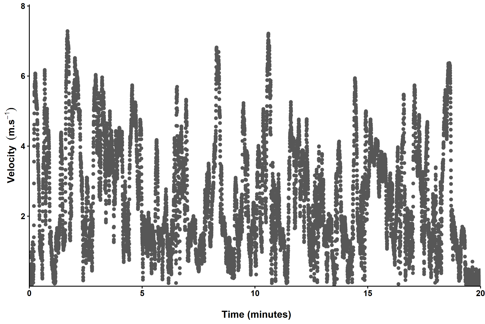
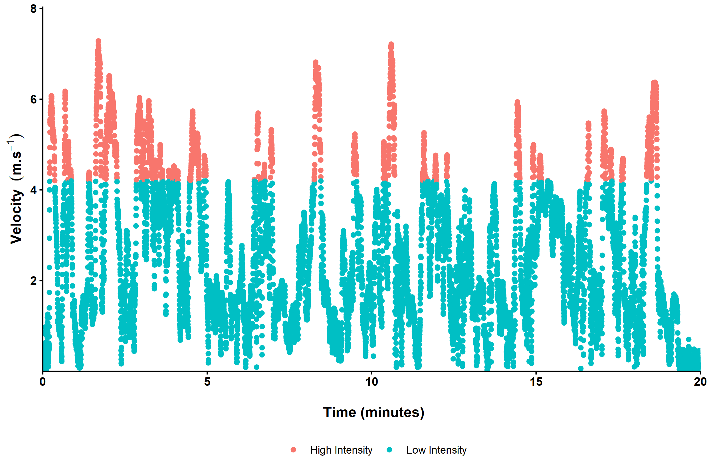
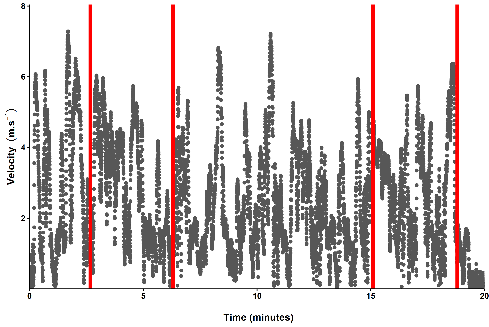

---
output:
  xaringan::moon_reader:
    css: ["VictoriaUniversity.css", "VictoriaUniversity-fonts.css"]
    nature:
      highlightStyle: github
      highlightLines: true
      countIncrementalSlides: false
      ratio: 16:9 
      
---
class: title-slide
background-image: url(https://raw.githubusercontent.com/SportStatisticsRSweet/WCSF_WorkshopInR/master/WhittenOval.jpg)
background-size: cover 
.center[ 
# R (is for research)  <br><br> How is R beneficial for <br> reproducibility in research?
   
## Alice Sweeting, PhD  
] 


   
 
 
 
```{r setup, include=FALSE}
options(htmltools.dir.version = FALSE, knitr.table.format = "html")
knitr::opts_chunk$set(fig.retina = 3, warning = FALSE, message = FALSE)
library(icon)      
library(tidyverse) 
library(emo) 
library(fontawesome)
```
   
```{r xaringan-panelset, echo=FALSE}
xaringanExtra::use_panelset()
``` 
   
```{r xaringan-tachyons, echo=FALSE}
xaringanExtra::use_tachyons()
```
   
   
```{r xaringan-logo, echo=FALSE}
xaringanExtra::use_logo(
  image_url = "https://github.com/TrackVU/TrackVU.github.io/blob/master/MicroUnits/TRAIN_WORD.png?raw=true",
  link_url = "https://www.trackvu.com/",
)
```
   
---
class: inverse, right, bottom
background-image: url(https://www.yarracity.vic.gov.au/-/media/all-images/yarra-city-council-images/events/events-2020/january/_bpp9388.jpg)
background-size: cover

.right[
.caption[
Image source: [Yarra City Council](https://aboriginalhistoryofyarra.com.au/)
]]

???

I’d like to begin by acknowledging the Traditional Owners of the land on which we meet today, which for me in Richmond, Victoria, are the Wurundjeri-willam people of the Kulin Nation. I also wish to pay my respects to Elders past, present and emerging. Pictured is the beautiful Birrarung.

---
class: inverse, left, top
background-image: url(https://raw.githubusercontent.com/SportStatisticsRSweet/SportStatisticsRSweet.github.io/master/SportDataR/VUSportStrategy.jpg)
background-size: contain

???

Victoria University (VU) is ranked in the top 20 globally for sport science education. VU has strong ambitions to be Australia’s leading sport university and a global leader in sport. The VU Sport Strategy, 2019-2023 helps drive to achieve this ambition.

---
class: inverse
background-image: url(https://raw.githubusercontent.com/SportStatisticsRSweet/SportStatisticsRSweet.github.io/master/vu-sport-strategy_Page_5.jpg)
background-size: contain

???

* As you can see on this page, there is a rich history of sport expertise at VU.  
* Over our history and particularly in the last decade, VU has been a leading local, national and global contributor in the field. 
* One of the seven key areas of the sport strategy is to maximise engagement with the sporting industry, through strategic partnerships. 
* One of these partnerships is with the Western Bulldogs Football Club, under which my role is embedded.


---
class: inverse, centre, top
background-image: url(https://pbs.twimg.com/media/CBUIeTBUcAA3irk.jpg)
background-size: cover

???

* VU's association with the Western Bulldogs began in the 1980's and has now grown to include a multi-faceted partnership with all four AFL, AFLW, VFL and VFLW WB teams. 
* The sport science partnership comprises workplace learning opportunities for students, joint staff appointments and professional development, WB staff and athlete access to VU facilities and expertise. 
* Another major facet of the strategicsport science partnership is collaborative research, including HDR student projects. I work side-by-side with the Bulldogs' coaching, medical and performance teams as part of a structured research program, with the ultimate goal of helping to improve on-field performance. 

---
class: inverse, center, top
background-image: url(https://raw.githubusercontent.com/SportStatisticsRSweet/WCSF_WorkshopInR/master/Figures/W02WBMe20DT993162838.JPG)
background-size: cover
# Data Sources in Australian Rules Football

???
* Data forms a large part of sport science research. For example, we can capture data on how the athletes are feeling (with respect to soreness and fatigue) before they commence training. Also their strength profiles over the course of a traning phrase or season.
* I'll now take you through what types of data we capture at the WB, as part of this strategic research partnership, to help improve on-field performance.

---
class: inverse, bottom
background-image: url(https://images.catapultsports.com/wp-content/uploads/2018/05/Fundamentals.jpg)
background-size: cover

.left[
.caption[
Image source: [Catapult Sports](https://www.catapultsports.com/)
]]


???

* Global Positioning Systems = Capture data on the position and displacement of players (outdoor use only)
* Local Positioning Systems = Capture position and displacement with better accuracy than GPS (indoor and outdoor use)
* Accelerometers = Capture changes in acceleration, orientation and direction (indoor and outdoor use)

---
class: center
# Athlete Physical Output

``````{r CreateDrillTable2, echo = FALSE}
library(kableExtra)
DrillEventData <- data.frame(Athlete = c("Warm Up", "Pair Kicks", "4v3 Game", "Stoppages"), 
                             'Total Duration (mins)' = c(10, 6, 5, 9),
                             'Total Distance (m)' = c(1026, 414, 849,921),
                             'Total HIR (m)' = c(83, 12, 277, 362))
DrillEventData$`Metres per Min (m/min)` <- DrillEventData$Total.Distance..m./DrillEventData$Total.Duration..mins.
colnames(DrillEventData) <- c("Drill", "Total Duration (mins)", "Total Distance (m)", 
                              "Total HIR (m)", "Metres per Min (m/min)")
DrillEventData %>%
  kable("html", escape = T, booktabs = T, align = "c",
  digits = 0, table.attr = "style = \"color: black;\"")%>%
  kable_styling(position = "center", font_size = 25, bootstrap_options = c("responsive","bordered"))%>%
  row_spec(0, bold = T, color = "white", background = "#000000", extra_css = "border-right: 1px solid; padding: 15px")  %>%
  #column_spec(1:6, border_left = T, border_right = T)  %>%
  row_spec(nrow(DrillEventData), color = "black", extra_css = "border-bottom: 1px solid")
```
<br>
<br>
<br>
<br>
--
.right[
[Corbett, D. M., Bartlett, J. D., O’connor, F., Back, N., Torres-Ronda, L., & Robertson, S. (2018). Development of physical and skill training drill prescription systems for elite Australian Rules football. Science and Medicine in Football, 2(1), 51-57.](https://doi.org/10.1080/24733938.2017.1381344)
]

???
* Aggregate parameters don't give granular insights into physical output
* Difficult to determine when output changes over time

---
class: center
# Athlete Physical Output


???
* Capture the raw trace from a wearble sensor (here is GPS)

---
class: center
# Athlete Physical Output


???
* Logical extension to seperate activity into low and high-intensity
* Thresholds used are often arbitary 
* Difficult to determine how output changes throughout a team-sport match, as a function of time


---
class: center
# Athlete Physical Output


???
* Need a way of understanding continuous data


---
class: center
# Athlete Physical Output


--

[Corbett, D. M., Sweeting, A. J., & Robertson, S. (2019). A change point approach to analysing the match activity profiles of team-sport athletes. Journal of sports sciences, 37(14), 1600-1608.](https://doi.org/10.1080/02640414.2019.1577941)


???
* Identify and describe segments of physical output in team-sport matches that are very different.
* The methodology presented may have application in comparing the specificity of training to matches and designing match rotation strategies.

---
class: center
# Collective Team-Behaviour


--

[Alexander, J. P., Spencer, B., Sweeting, A. J., Mara, J. K., & Robertson, S. (2019). The influence of match phase and field position on collective team behaviour in Australian Rules football. Journal of sports sciences, 37(15), 1699-1707.](https://www.tandfonline.com/doi/full/10.1080/02640414.2019.1586077) 
--
<br> Thesis recently conferred `r emo::ji("beer")`

???
* Collective team behaviour in invasion sports refers to how individual players position themselves across a field of play to form an overall group organisation
* Determining collective team behaviour may provide a greater understanding of team tactics or game style.
* Jeremy investigated the influence of match phase and field position on collective team behaviour
* Players were more inclined to re-position closer to their defensive end to restrict space when the ball was closer to their goal and conversely, press higher up the field when the ball was in their forward half


---
class: inverse, right, top
background-image: url(https://raw.githubusercontent.com/SportStatisticsRSweet/WCSF_WorkshopInR/master/Figures/AFL_Hunter.JPG)
background-size: cover
# Skilled Involvements

???
* Currently, events and outcomes are captured in statistical analysis of team sports performance. This is frequency count data where a human manually codes performance variables including kicks, tackles and handballs, live during a game or post-hoc via video 
* Kicking is an important action in AF, as it constitutes the predominant form of strategic ball movement and the sole manner in which a goal can be scored.
* On average, each player executes a kick every ten minutes within an AFL match 
* The completion of a successful kick is a resultant of multiple attributes of the game and the immediate constraints that emerge on the kick, such as opposition pressure, team mates’ availability and the current status of the ball carrier
* Accounting for some of these constraints is really important, to give context to the skilled involvements or kicks that occur
* For example, we can look at the source of the kick, so in an AFL context was it from a mark/ free kick or at a stoppage. Was the player on the run whilst kicking or stationary? Did they get rid of the ball in less than two seconds or was it six seconds? How long was the kick? Was the player being tackled whilst they were trying to kick the ball?


---
class: center
# Skilled Involvements


--
<br>
[Browne, P. R., Sweeting, A. J., Davids, K., & Robertson, S. (2019). Prevalence of interactions and influence of performance constraints on kick outcomes across Australian Football tiers: Implications for representative practice designs. Human Movement Science, 66, 621-630.](https://www.sciencedirect.com/science/article/pii/S0167945719301939) 
--
<br>*very* close to submitting his thesis `r emo::ji("muscle")`

???
*  Example of how adding additional constraint variables and considering the constraint interaction alters the mean efficiency of the kick outcome. * Percentage values indicate confidence level of an effective kick.

---
class: center
# Wearables to Detect Skilled Involvements


.right[Image: [iMeasureU](https://imeasureu.com/wp-content/uploads/2019/10/Soccer-kick.jpg)]
<br>
--
[Cust, E., Ball, K., Sweeting, A., & Robertson, S. (2019). Biomechanical characteristics of Elite Female Australian Rules Football Preferred and Non-preferred Drop Punt Kicks. In Proceedings of the 7th International Conference on Sport Sciences Research and Technology Support (icSPORTS 2019) (pp. 32-37). SCITEPRESS.](http://vuir.vu.edu.au/39871/1/icSPORTS_2019_15.pdf)
--
<br>
thesis recently classified as passed `r emo::ji("tada")`

???
*  Emily presented her work at the last iHES seminar but her research could be of benefit to practitioners in linking targeted field coaching drills and conditioning programs tailored to identified kick skill and movement deficiencies.

---
class: inverse, center, top
background-image: url(https://cdn.pixabay.com/photo/2016/08/20/06/15/statistic-1606951_960_720.png)
background-size: cover


---
class: inverse, center, top
background-image: url(https://cdn.pixabay.com/photo/2016/10/26/12/48/excel-1771393_960_720.jpg)
background-size: cover

---

class: center, top

# Advantages of Excel for (Sport Science) Research

.left[
* Easy to download, install, open.
]

--
.left[
* Interactive, (fairly) friendly to save, send, open and edit
]
--
.left[
* Point and click to enter data, create figures, calculate math
]
--
.left[
* Many tabs = data entry, analysis, visualisation, (dashboard) reporting
]
--
.left[
* Can even run (basic to advanced) statistics!
]
--
.left[
* Help is never far away...
]
 


---

class: center, top

# But before long...


---

class: center, top

# We end up here!


---

class: center, top

# Working with Data in (Sport Science) Research

.left[
* Abundance of data, from varying technologies at differing sample rates, stored in multiple formats.
]

--

.left[
* Large datasets, that often need cleaning and merging, which is likely performed manually.
]

--

.left[
* Need to ensure accurate, stringent and reproducible work. 
]

---

class: center, top

# Working with Data in (Sport Science) Research

.left[
* Abundance of data, from varying technologies at differing sample rates, stored in multiple formats.
]


.left[
* Large datasets, that often need cleaning and merging, which is likely performed manually.
]


.left[
* Need to ensure accurate, stringent and reproducible work. 
]
.center[
 
]
.right[
[Reproducibility: A tragedy of errors](https://www.nature.com/news/reproducibility-a-tragedy-of-errors-1.19264)
]

---

class: center, top

# Working with Data in (Sport Science) Research

.left[
* Abundance of data, from varying technologies at differing sample rates, stored in multiple formats.
]


.left[
* Large datasets, that often need cleaning and merging, which is likely performed manually.
]


.left[
* Need to ensure accurate, stringent and reproducible work. 
]


---

class: center, top

# Benefits of Programming for (Sport Science) Research

.left[
* Quickly create beautiful and insightful [graphics](https://ggplot2.tidyverse.org/) 
]
--
.left[
* Ideal for [reproducibility](https://github.com/ropensci/reproducibility-guide) and accessiblity in research
]
--
.left[
* Automate time-consuming workflows and generate specific [reports](https://rmarkdown.rstudio.com/)
]
--
.left[
* Create [presentations](https://github.com/yihui/xaringan) from code (such as this one!)
]
--
.left[
* Share content, research, materials via [websites](https://github.com/rstudio/blogdown) and custom-designed [apps](https://shiny.rstudio.com/)
].center[

] .right[Artwork by [@allison_horst](https://github.com/allisonhorst/stats-illustrations)]

---
class: center, top

# Why I Learnt to Program in R? 

.left[
* Free, powerful and open-source, developed with statistics and graphics in mind.   
]

--

.left[
* User-created [packages](https://cran.r-project.org/web/packages/available_packages_by_name.html) that allow for data cleaning, manipulation, visualisation and reporting.
]

.center[

] 
.right[Artwork by [@allison_horst](https://github.com/allisonhorst/stats-illustrations)]


---
class: center, top

# Why I Learnt to Program in R? 

.left[
* Free, powerful and open-source, developed with statistics and graphics in mind.   
]


.left[
* User-created [packages](https://cran.r-project.org/web/packages/available_packages_by_name.html) that allow for data cleaning, manipulation, visualisation and reporting.
]


.left[
* Annual [UseR!](https://www.r-project.org/conferences/) Conferences, [The R Journal](https://journal.r-project.org/), local and online [communities](https://blog.revolutionanalytics.com/local-r-groups.html), that also support diversity etc; [RLadies](https://www.meetup.com/en-AU/rladies-melbourne/)
]
.center[

] 
.right[Artwork by [@allison_horst](https://github.com/allisonhorst/stats-illustrations)]


---
class: center


.right[
[Wildlife biology, big data, and reproducible research](https://wildlife.onlinelibrary.wiley.com/doi/10.1002/wsb.847)
]

---

class: center, top

# How do I get started?

.left[
* First, install [R](https://www.r-project.org/) (required) from your local CRAN.
]

--
.left[
* Next, install [RStudio](https://www.rstudio.com/products/rstudio/), as it is a friendly interface to learn and use R.
]

--
.left[
* Plenty of free, online resources to help learn, including [RStudio Education](https://education.rstudio.com/).
]
--
.left[
* Online Q&A forum [Stack Overflow](https://stackoverflow.com/) also contains a community of help. 
]
--
.left[
* My number 1 resource for beginners: [R for Data Science](https://r4ds.had.co.nz/) by Garrett Grolemund and Hadley Wickham
]
--
<br>
### `r fa("hourglass-start", fill = "black")` Start out with a small dataset that you know really well
--
<br>
### `r fa("copy", fill = "black")` Try to reproduce someone else's analysis. See `#TidyTuesday`
--
<br>
### `r fa("github", fill = "black")` Take a look at the GitHub accounts of others within the research community

---
class: middle, center


---
class: middle, center


---
class: right, top, inverse
background-image: url(https://cdn.pixabay.com/photo/2017/10/28/15/44/new-home-2897352_960_720.jpg)
background-size: cover


---
class: right, top, inverse
background-image: url(https://raw.githubusercontent.com/SportStatisticsRSweet/WCSF_WorkshopInR/master/Figures/Questions.JPG)
background-size: cover
# Any Questions? 

<br>
<br>
<span style = 'font-size: 50%;'>
.right[
### `r fa("envelope", fill = "white")` [Alice.Sweeting@vu.edu.au](mailto:Alice.Sweeting@vu.edu.au)<br>
### `r fa("twitter", fill = "white")` [alicesweeting](https://twitter.com/alicesweeting)<br>
### `r fa("github", fill = "white")` [SportStatisticsRSweet](https://github.com/SportStatisticsRSweet)<br>
]
<br>
