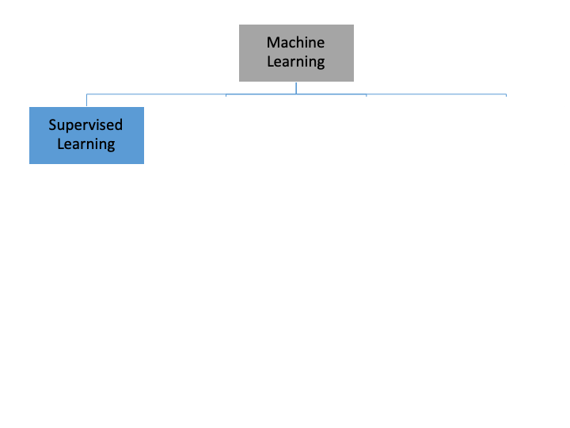
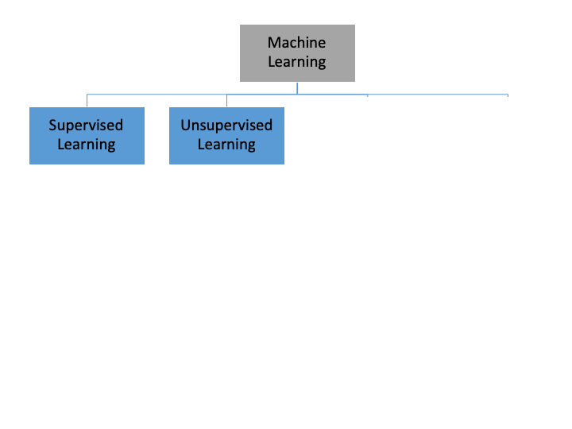
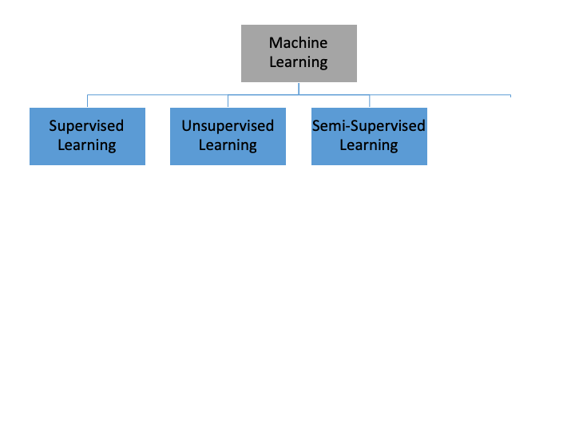
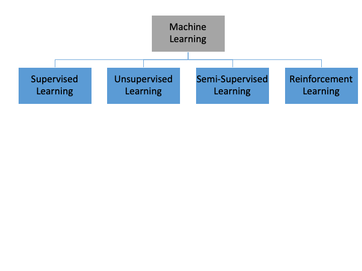
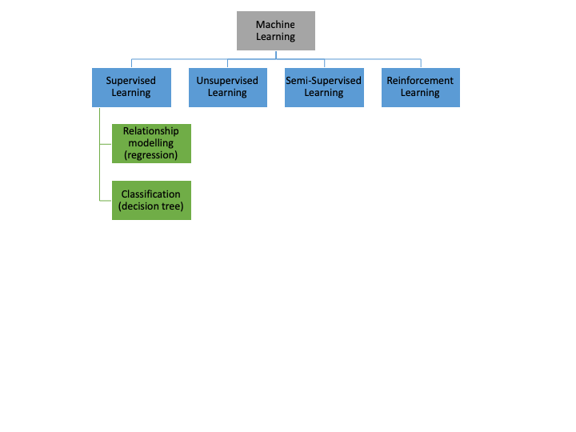
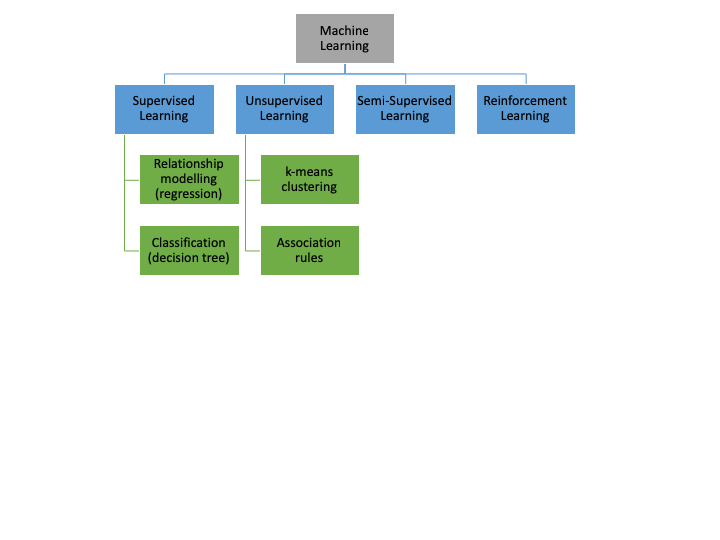
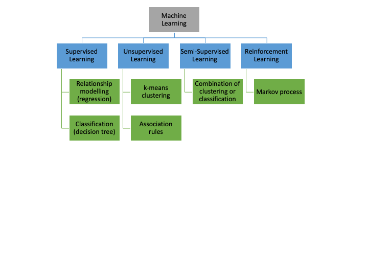
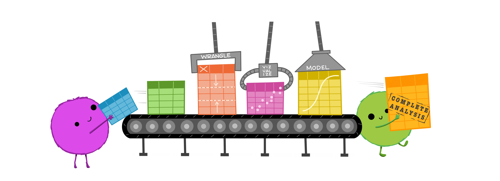

---
output:
  xaringan::moon_reader:
    css: ["VictoriaUniversity.css", "rladies-fonts"]
    nature:
      highlightStyle: github
      highlightLines: true
      countIncrementalSlides: false
      ratio: 16:9 

---
class: title-slide
background-image: url(https://img.rawpixel.com/s3fs-private/rawpixel_images/website_content/rm407-009.jpg?w=1300&dpr=1&fit=default&crop=default&q=80&vib=3&con=3&usm=15&bg=F4F4F3&auto=format&ixlib=js-2.2.1&s=e2fe5a82c3c1e5b1867126bea6490bc5)
background-size: cover 

.logoposL[
  
]

.logoposR[
  
]

<br>
<br>
  
.center[ 
# A Machine Learning Primer   
  ]

<br>
<br>
<br>
<br>
<br>
<br>
<br>
<br>
<br>
<br>
<br>
<br>
<br>
<br>
.center[ 
## Alice Sweeting, PhD 
]


```{r setup, include=FALSE}
options(htmltools.dir.version = FALSE, knitr.table.format = "html")
knitr::opts_chunk$set(fig.retina = 3, warning = FALSE, message = FALSE)
library(tidyverse) 
library(icons)  
```

```{r xaringan-tachyons, echo=FALSE}
xaringanExtra::use_tachyons()
```

---
class: left, bottom, inverse
background-image: url(https://cdn.pixabay.com/photo/2016/03/26/13/09/workspace-1280538_1280.jpg)
background-size: cover

# A (brief) Overview of... 

--
  <br>
  * ## Machine Learning
  
--
  <br>
  * ## Techniques for Data Analysis
  
--
  <br>
  * ## Applications in Sport Performance
  
  
---
class: left, bottom, inverse
background-image: url(https://cdn.pixabay.com/photo/2020/02/15/14/19/network-4851079_1280.jpg)
background-size: cover

# What is Machine Learning?

???
  - Ask for definitions in the chat
- Applications or defintions

---
class: center, top
# What is Machine Learning?

.bg-washed-blue.b--dark-blue.ba.bw2.br3.shadow-5.ph4.mt5[
  Machine learning is a branch of artificial intelligence (AI) and computer science which focuses on the use of data and algorithms to imitate the way that humans learn, gradually improving its accuracy.
  
.tr[
 — IBM
  ]]

--
  
.bg-washed-blue.b--dark-blue.ba.bw2.br3.shadow-5.ph4.mt5[
    Machine learning is a subfield of artificial intelligence, which is broadly defined as the capability of a machine to imitate intelligent human behavior. Artificial intelligence systems are used to perform complex tasks in a way that is similar to how humans solve problems.
    
.tr[
 — MIT Sloan
  ]]

???
  - Machine Learning is defined as the study of computer programs that leverage algorithms and statistical models to learn through inference and patterns without being explicitly programmed. Machine learning approaches have been popularised recently, due to their ability to learn from data, without being explicitly instructed or programmed to do so 


---
class: center, top
# Machine Learning Tasks

  
???
  - Within machine learning, there are multiple ‘families’ of algorithms exist that can each be applied to the same data set to form differing outputs, decisions and recommendations. Although often represented in different ways, these are often considered based on the tasks they perform including; Supervised, Unsupervised, Semi-Supervised and Reinforcement learning. 
- Supervised machine learning algorithms can apply what has been learned in the past to new data using labeled examples to predict future events. Starting from the analysis of a known training dataset, the learning algorithm produces an inferred function to make predictions about the output values. The system is able to provide targets for any new input after sufficient training. The learning algorithm can also compare its output with the correct, intended output and find errors in order to modify the model accordingly.
- Supervised tasks relate to those that rely on labelled data; specifically data which consists of paired inputs and outputs. For example, for each action or set of actions (i.e., kinematic data whilst undertaking a 20 m sprint), a resultant output or event (i.e., 20 m sprint time) is also included. 
- Labelled datasets can then be used for the purposes of training an algorithm, thereby leading to the modelling of relationships and inter-dependencies between an output variable (be it continuous or categorical) and its corresponding set of inputs. Consequently, supervised tasks are commonly used for prediction problems.


---
class: center, top
# Machine Learning Tasks

  
???
  - In contrasts, unsupervised machine learning algorithms are used when the information used to train is neither classified nor labeled. Unsupervised learning studies how systems can infer a function to describe a hidden structure from unlabeled data. The system doesn’t figure out the right output, but it explores the data and can draw inferences from datasets to describe hidden structures from unlabeled data.
- In contrast, unsupervised tasks consist of unlabelled data, whereby an output variable is either unknown or not required. Consequently, they tend to be more useful for descriptive purposes, or uncovering new patterns in previously unexplored datasets. 


---
class: center, top
# Machine Learning Tasks

  
???
  - Semi-supervised machine learning algorithms fall somewhere in between supervised and unsupervised learning, since they use both labeled and unlabeled data for training – typically a small amount of labeled data and a large amount of unlabeled data. The systems that use this method are able to considerably improve learning accuracy. Usually, semi-supervised learning is chosen when the acquired labeled data requires skilled and relevant resources in order to train it / learn from it. Otherwise, acquiring unlabeled data generally doesn’t require additional resources.
- So these tasks they consist of some combination of labelled and unlabelled data. 

---
class: center, top
# Machine Learning Tasks

  
  
???
  - Reinforcement machine learning algorithms is a learning method that interacts with its environment by producing actions and discovers errors or rewards. Trial and error search and delayed reward are the most relevant characteristics of reinforcement learning. This method allows machines and software agents to automatically determine the ideal behavior within a specific context in order to maximize its performance. Simple reward feedback is required for the agent to learn which action is best; this is known as the reinforcement signal.
- Reinforcement tasks entail a machine being exposed to a given environment in order for it to train itself through an iterative process of trial and error 


---
class: center, top
# Machine Learning Techniques

  
  
???
  - Under each of these tasks, various techniques exist by which these tasks can be carried out. These techniques are often grouped into five types. 
- For supervised tasks, i) relationship modelling and ii) classification methods are typically used. 
- Relationship modelling is perhaps the most commonly observed. It works by fitting a function or model that best describes relationships between a set of variables and a specific outcome of interest (dependent variables). Regression analysis is the best-known type of relationship modelling, with multiple variations available. 
- The other form of supervised learning, classification, aims to predict a given discrete class output (i.e., category or group) using a set of input variables 
- Here, decision trees can be used, for example to explain ‘win/loss’ match outcome in team sports 

---
class: center, top
# Machine Learning Techniques

  
  
???
  - Clustering represents a method of unsupervised learning that aims to summarise key features of data into groups using just the features of the data and no output information (unlike in classification)
- The result of a cluster analysis is the formation of a number of groups, which in some cases are defined by the end-user. Instances or items are grouped together based on their level of similarity as defined by these features, or the extent to which they are dissimilar to other groups
- k-means; used to develop distinctive team profiles based on performance indicators 
- Association rule mining, aims to extract meaningful and typically frequently occurring patterns in data (Agrawal, Imielinski & Swami, 1993). A number of types of rule mining exist. Simple association rule mining aims to discover commonly occurring associations with different states, whereas sequential rule mining also emphasises the time course or sequencing of such events. Examples of these in sport may be used to identify constraint patterns in training environments (Robertson et al., 2019) and preferred patterns of play in team sport 


---
class: center, top
# Machine Learning Techniques

  
  
???
 - Semi-supervised and reinforcement tasks may employ combinations of these other approaches, although in reinforcement learning, markov processes can be used. 
- Example is a model which describes a sequence of possible events in which the probability of each event depends only on the state attained in the previous event. 
- In sport, an example of this could be player evaluation or handicapping


---
class: left, top 
# Applications of Machine Learning in Sport

Work by [Emily Cust](https://twitter.com/EmCust) a PhD graduate of iHES `r emo::ji("tada")`
--
  <br>
  <br>
  Conducted a [systematic review](https://doi.org/10.1080/02640414.2018.1521769) on machine and deep learning for sport-specific movement recognition.
.center[
  
]
.right[Image: [Machine and deep learning for sport-specific movement recognition (JSS)](https://www.tandfonline.com/eprint/BZ3YbixRkJmWRkC7ua5x/full)]


---
class: left, top 
# Collective Team-Behaviour in AFL Athletes 

Work by [Jeremy Alexander](https://twitter.com/jeremypalex) another PhD graduate of iHES `r emo::ji("tada")`

--
  
Examined the [influence](https://www.tandfonline.com/doi/10.1080/02640414.2019.1586077) of match phase and field position on collective team behaviour in elite Australian Rules football

.center[
  
] 
.right[Image from [JSS](https://www.tandfonline.com/doi/10.1080/02640414.2019.1586077) paper]


---
class: left, top 
# The Analysis & Interaction of Constraints in AFL Matches 

Work by [Peter Browne](https://twitter.com/_PeterBrowne) another PhD graduate of iHES `r emo::ji("tada")`

--
  
Discrete performance indicators (etc a kick or handball) do not give us the full picture or **context** of the action performed

--

Modelling constraint interactions and [influence](https://www.sciencedirect.com/science/article/pii/S0167945719301939#b0180) on kicking performance, across three performance tiers of Australian Rules competitions

.center[
 
]

---
class: center, top
# Machine Learning - Benefits

.pull-left[
* Varying analytical approaches can be used to address the same problem
]

--

.pull-left[
* Consideration of complexity and non-linearity within data/ problem
]

--

.pull-left[
* Awareness of different techniques permits greater flexiblity 
]

--

.pull-left[
* Can be deployed through programming languages (R, Python etc) 
]





---
class: center, top
# Machine Learning - Pitfalls


.pull-left[
* Garbage in, definitely equals garbage out!
]


???
- no amount of sophisticated modelling will cause a recommendation to be of value to the end user or human if it is based on flawed data
- Error is inherent in all measurement, we could spend an entire afternoon on the measurement properties of tools!
- Understand the validity and reliability or accuracy and precision of the tools that you use! 


--

.pull-left[
* Models can be prone to overfitting (and underfitting)
]

<br>


.small[Image from IBM]


???
- Overfitting can be defined as an analysis that corresponds too closely or exactly to a particular set of data, and may therefore fail to fit additional data or predict future observations reliably. Essentially, an over-fitted model is one that contains more inputs than can be justified for the given problem. Unfortunately, many of the machine learning techniques introduced before can be susceptible to overfitting. This is because they tend to be more flexible in their ability to map complex data than many linear techniques and can therefore often derive more specific solutions to a given problem.
- The most common way of testing overfitting is through cross-validation
- An example of overfitting with respect to sport science can be given in talent identification, whereby a model to predict future performance of an athlete is constructed based on historical data collected from previous successful performers. The model is then used to predict the career trajectories of newly tested athletes to help inform whether they should be admitted into a funded program. In this scenario, an underfit solution may utilise a single value or linear function to classify these ‘successful’ or ‘unsuccessful’ athletes. For instance, it might stipulate that in order for an athlete to succeed at a given sport, they are required to be of a minimum height or body mass. 


---
class: center, top

# Any Questions?


.bottom[
```{r icon-chunk, echo=FALSE}
fontawesome("envelope", style = "solid")
```
Alice.Sweeting@vu.edu.au
]


